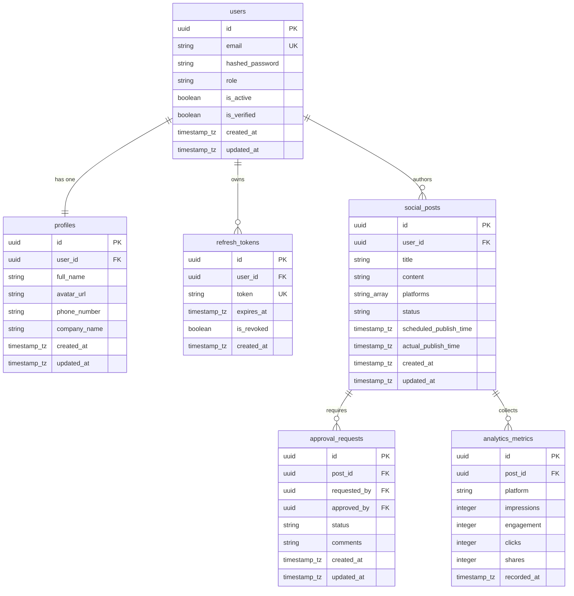

# Database Schema Specification

This document details the PostgreSQL 17 database schema for the Social Media Marketing AI Agent SaaS. The tables are normalized to Third Normal Form (3NF) to minimize data redundancy and enforce relational integrity.

---

## Entity Relationship Summary

---

## Tables Definition

### 1. `users`
Stores user authentication records and platform roles.

| Column | Type | Constraints | Description |
| :--- | :--- | :--- | :--- |
| `id` | `UUID` | `PRIMARY KEY`, `DEFAULT gen_random_uuid()` | Unique user identifier. |
| `email` | `VARCHAR(255)` | `UNIQUE`, `NOT NULL` | User email address. |
| `hashed_password` | `VARCHAR(255)` | `NOT NULL` | Salted bcrypt hash. |
| `role` | `VARCHAR(50)` | `NOT NULL`, `DEFAULT 'viewer'` | Access control role (`admin`, `editor`, `viewer`). |
| `is_active` | `BOOLEAN` | `NOT NULL`, `DEFAULT TRUE` | Soft disable mechanism. |
| `is_verified` | `BOOLEAN` | `NOT NULL`, `DEFAULT FALSE` | Email verification flag. |
| `created_at` | `TIMESTAMPTZ` | `NOT NULL`, `DEFAULT NOW()` | Record creation timestamp. |
| `updated_at` | `TIMESTAMPTZ` | `NOT NULL`, `DEFAULT NOW()` | Last update timestamp. |

* **Indexes**:
  * `idx_users_email` (B-Tree): Created automatically by `UNIQUE`. Speeds up login checks.
  * `idx_users_role` (B-Tree): Useful for administrative queries filtering by role.

---

### 2. `profiles`
Contains non-auth related user details. Separated from `users` to optimize auth queries.

| Column | Type | Constraints | Description |
| :--- | :--- | :--- | :--- |
| `id` | `UUID` | `PRIMARY KEY`, `DEFAULT gen_random_uuid()` | Profile record identifier. |
| `user_id` | `UUID` | `UNIQUE`, `NOT NULL`, `FOREIGN KEY` | Reference to parent `users(id)` ON DELETE CASCADE. |
| `full_name` | `VARCHAR(150)` | `NOT NULL` | User's full display name. |
| `avatar_url` | `VARCHAR(512)` | `NULL` | Link to MinIO storage avatar. |
| `phone_number` | `VARCHAR(20)` | `NULL` | Optional contact number. |
| `company_name` | `VARCHAR(100)` | `NULL` | Associated tenant company. |
| `created_at` | `TIMESTAMPTZ` | `NOT NULL`, `DEFAULT NOW()` | Creation timestamp. |
| `updated_at` | `TIMESTAMPTZ` | `NOT NULL`, `DEFAULT NOW()` | Last modification timestamp. |

* **Indexes**:
  * `idx_profiles_user_id` (B-Tree): Speeds up profile loads during user session lookup.

---

### 3. `refresh_tokens`
Stores JWT refresh tokens for persistent login sessions.

| Column | Type | Constraints | Description |
| :--- | :--- | :--- | :--- |
| `id` | `UUID` | `PRIMARY KEY`, `DEFAULT gen_random_uuid()` | Record identifier. |
| `user_id` | `UUID` | `NOT NULL`, `FOREIGN KEY` | Reference to `users(id)` ON DELETE CASCADE. |
| `token` | `VARCHAR(512)` | `UNIQUE`, `NOT NULL` | Cryptographic signature string. |
| `expires_at` | `TIMESTAMPTZ` | `NOT NULL` | Expiration limit. |
| `is_revoked` | `BOOLEAN` | `NOT NULL`, `DEFAULT FALSE` | Security blacklist check. |
| `created_at` | `TIMESTAMPTZ` | `NOT NULL`, `DEFAULT NOW()` | Creation timestamp. |

* **Indexes**:
  * `idx_refresh_tokens_token` (B-Tree): Created by `UNIQUE`. Fast token verification.
  * `idx_refresh_tokens_user_id` (B-Tree): Allows cleanups of expired sessions per user.

---

### 4. `social_posts`
Stores the post templates generated by the AI SEO/Content agents.

| Column | Type | Constraints | Description |
| :--- | :--- | :--- | :--- |
| `id` | `UUID` | `PRIMARY KEY`, `DEFAULT gen_random_uuid()` | Post identifier. |
| `user_id` | `UUID` | `NOT NULL`, `FOREIGN KEY` | Reference to `users(id)` ON DELETE SET NULL. |
| `title` | `VARCHAR(255)` | `NOT NULL` | Title of the post campaign. |
| `content` | `TEXT` | `NOT NULL` | Main markdown/text content. |
| `platforms` | `VARCHAR(50)[]` | `NOT NULL` | Target publishing channels (e.g. `{'linkedin', 'twitter'}`). |
| `status` | `VARCHAR(50)` | `NOT NULL`, `DEFAULT 'draft'` | Status (`draft`, `pending_approval`, `approved`, `published`, `failed`). |
| `scheduled_publish_time` | `TIMESTAMPTZ` | `NULL` | Scheduled queue time. |
| `actual_publish_time` | `TIMESTAMPTZ` | `NULL` | Successful publish time. |
| `created_at` | `TIMESTAMPTZ` | `NOT NULL`, `DEFAULT NOW()` | Creation timestamp. |
| `updated_at` | `TIMESTAMPTZ` | `NOT NULL`, `DEFAULT NOW()` | Last edit timestamp. |

* **Indexes**:
  * `idx_social_posts_user_id` (B-Tree): Quick lookup of campaign records per user.
  * `idx_social_posts_status` (B-Tree): Critical index for background worker polling scheduled/pending posts.
  * `idx_social_posts_scheduled` (B-Tree): Speeds up querying posts scheduled around the current date.

---

### 5. `approval_requests`
Handles the editorial workflow for post authorization.

| Column | Type | Constraints | Description |
| :--- | :--- | :--- | :--- |
| `id` | `UUID` | `PRIMARY KEY`, `DEFAULT gen_random_uuid()` | Request identifier. |
| `post_id` | `UUID` | `NOT NULL`, `FOREIGN KEY` | Reference to `social_posts(id)` ON DELETE CASCADE. |
| `requested_by` | `UUID` | `NOT NULL`, `FOREIGN KEY` | Reference to creator `users(id)`. |
| `approved_by` | `UUID` | `NULL`, `FOREIGN KEY` | Reference to reviewer `users(id)`. |
| `status` | `VARCHAR(50)` | `NOT NULL`, `DEFAULT 'pending'` | Workflow state (`pending`, `approved`, `rejected`). |
| `comments` | `TEXT` | `NULL` | Rejection reason or notes. |
| `created_at` | `TIMESTAMPTZ` | `NOT NULL`, `DEFAULT NOW()` | Creation timestamp. |
| `updated_at` | `TIMESTAMPTZ` | `NOT NULL`, `DEFAULT NOW()` | Timestamp of state changes. |

* **Indexes**:
  * `idx_approvals_post_id` (B-Tree): Resolves workflow requests per post.
  * `idx_approvals_status` (B-Tree): Quick retrieval of pending approval requests for client notification dashboards.

---

### 6. `analytics_metrics`
Tracks performance indicators retrieved from published campaigns.

| Column | Type | Constraints | Description |
| :--- | :--- | :--- | :--- |
| `id` | `UUID` | `PRIMARY KEY`, `DEFAULT gen_random_uuid()` | Metric entry identifier. |
| `post_id` | `UUID` | `NOT NULL`, `FOREIGN KEY` | Reference to `social_posts(id)` ON DELETE CASCADE. |
| `platform` | `VARCHAR(50)` | `NOT NULL` | Targeted social network name. |
| `impressions` | `INTEGER` | `NOT NULL`, `DEFAULT 0` | Read counts. |
| `engagement` | `INTEGER` | `NOT NULL`, `DEFAULT 0` | Total reactions. |
| `clicks` | `INTEGER` | `NOT NULL`, `DEFAULT 0` | URL clicks. |
| `shares` | `INTEGER` | `NOT NULL`, `DEFAULT 0` | Repost/Share count. |
| `recorded_at` | `TIMESTAMPTZ` | `NOT NULL`, `DEFAULT NOW()` | Metrics capture date. |

* **Indexes**:
  * `idx_analytics_post_id` (B-Tree): Fast analytics retrieval for specific campaigns.
  * `idx_analytics_recorded_at` (B-Tree): Speeds up time-series reports (e.g. engagement over the past 30 days).
